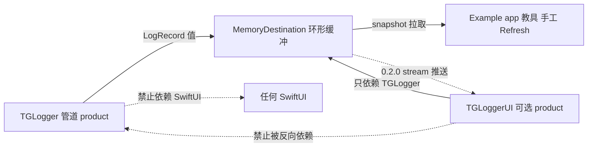

# SwiftUI 进程内控制台 —— 口径对照与决策

**状态**：决策记录（`TGLoggerUI` 尚未实现）
**核对基线**：0.1.0 / commit `42016a5` / 2026-09-15

本文做两件事：

1. 把仓库里所有提到「SwiftUI / 控制台」的地方逐条列出来，判定**哪些是真分歧、哪些只是层面混着说**；
2. 定下 0.2.0 `TGLoggerUI` 的边界与下一步顺序。

相关代码：[`MemoryDestination`](../Sources/TGLogger/Destinations/MemoryDestination.swift)、[`LogDestination`](../Sources/TGLogger/LogDestination.swift)、[`Example/TGLoggerDemo`](../Example/TGLoggerDemo/)。

---

## 0. 三行速览

- **结论**：全仓 10 处直接提及，**真分歧 0 处**。看着矛盾，是因为同一句话在说三层不同的东西 —— SPM product 层 / Example 工程层 / 未来能力层。
- **影响**：0.1.0 的公开 product 保持零 SwiftUI；Example 的列表是教具，不是库；`TGLoggerUI` 排到 0.2.0 且是**可选**第二 product。
- **细读建议**：只想知道「到底有没有矛盾」→ §1、§2；要动手做控制台 → §5–§7。

---

## 1. 逐条清点：每一句在哪里、说的是哪一层

核对方法：在仓库内检索 `SwiftUI|TGLoggerUI|控制台|Console|snapshot|products`（覆盖 `.md`、`Sources/`、`Example/`），逐条判定其**主语是谁**。

| # | 位置 | 原文（摘） | 说的层 | 判定 |
|---|------|-----------|--------|------|
| 1 | `README.md:22` | "Not in 0.1.0: in-app SwiftUI console as a **library product**" | product | 与 #5、#8 一致 |
| 2 | `README.md:26` | Example「is **not** a Swift package product」，SPM 只暴露 `TGLogger` | 工程 | 与 #1 不矛盾：不同对象 |
| 3 | `README.md:90` | 链到本文：why the example list is **not** a library console | 三层都提 | 本文即是它的展开 |
| 4 | `DesignInfo.md:22` | 「后续控制台 / 导出直接消费 `MemoryDestination.snapshot()`」 | 能力（未来） | 与 #10 一致 |
| 5 | `DesignInfo.md:64` | 非目标：把 SwiftUI 控制台做成 **package product**（Demo 里用 `snapshot()` 自学即可） | product | 与 #1 同义 |
| 6 | `DesignInfo.md:78` | 0.2.0：可选独立 product `TGLoggerUI` | 能力（未来） | 与 #1 不矛盾：0.1.0 没有 ≠ 永远没有 |
| 7 | `Example/TGLoggerDemo/README.md:3` | "iOS 17+ **SwiftUI app** that shows how to bootstrap and use TGLogger" | 工程 | ← **唯一一句容易让读者以为「库里有控制台」的话** |
| 8 | `Example/.../ContentView.swift:59` | `Section("Latest records")` 列出 `store.records` | 工程（UI） | 教具；`Package.swift` 里没有它 |
| 9 | `Example/.../DemoLogStore.swift:11` | "Keeps `MemoryDestination` so the UI can snapshot records. This type lives in the **example app**, not in the TGLogger package." | 工程 | 这句已经把边界说清了 |
| 10 | `Destinations/MemoryDestination.swift:3` | "In-process ring buffer for debug inspection and **future UI consoles**" | 能力（未来） | 与 #4、#6 一致 |

另有三处不是「说法」而是**约束**，判分歧时必须一起读：

- `Package.swift:13-18` —— `products` 里只有 `TGLogger`。这是 product 层的事实来源（代码 > 文档）。
- `LogDestination.swift:3` —— "Destinations must not hop to `MainActor`"。
- `LogCenter.swift:6-7` —— 全链路同步，从不 hop `MainActor`。
- `CHANGELOG.md:18` —— 0.1.0 条目里 `MemoryDestination` 只以 "ring buffer" 出现，**没有**任何 UI 条目：沉默也是口径。

---

## 2. 判定：到底有几处「不同」

**真分歧：0 处。** 看起来冲突的四组，全部是层面混淆：

| 看似冲突 | 实际 |
|----------|------|
| #7「是个 SwiftUI app」 × #1「0.1.0 没有 SwiftUI 控制台」 | Example 是 **App 工程**（可以 `import SwiftUI`）；product 是 **库**（不许）。两个对象 |
| #5「不要 App 内控制台」 × #6「0.2.0 做 `TGLoggerUI`」 | 前者约束 0.1.0 的**交付范围与默认 product**；后者是未来的**可选第二 product** |
| #5「Demo 里用 `snapshot()` 自学即可」 × #8「Demo 已经有列表」 | 前者是给**库消费者**的建议（想自己画就 `snapshot()`）；后者是仓库内**教具**已经画好了 |
| #10「future UI consoles」 × 现在没有 | "future" 是关键字。`MemoryDestination` 生来就是给未来的控制台准备的 |

**所以「SwiftUI 部分是否有很多不同」的答案是：说法不多（10 处），真正会打架的点只有 2 个，且都不在文档层而在实现层：**

1. **越界写线程**：只要有人在 `MemoryDestination.write` 里 `Task { @MainActor in … }`，`LogDestination` 的契约（`LogDestination.swift:3`）当场作废，同时违反 `LogCenter.swift:6-7`。这是**唯一**真正会冲突的约束。
2. **越界放位置**：把列表搬进 `TGLogger` target，`README.md:22` 与 `DesignInfo.md:64` 同时失真，且纯后台 / 无界面 target 会被迫链上 SwiftUI。

换句话说：文档口径是自洽的，**风险全部集中在「谁来画 UI、画在哪一层」这一个决定上**。

---

## 3. 三层模型（后面所有讨论都按这个分层）



三层各自的「可以 / 不可以」：

| 层 | 可以 | 不可以 |
|----|------|--------|
| 管道（`TGLogger`） | 同步 `write`、被任意线程并发调用 | 依赖 SwiftUI、hop `MainActor`、知道 UI 存在 |
| Example 工程 | `import SwiftUI`、自己画列表、按 Refresh | 出现在 `Package.swift` 的 `products` / `targets` |
| `TGLoggerUI`（0.2.0） | 依赖 `TGLogger`、用 `@Observable` / `@MainActor` | 被 `TGLogger` 反向依赖、改成 `TGLogger` 的默认行为 |

---

## 4. 已冻结的决定（0.1.0）

1. 写日志保持同步。`Logger` / `LogDestination.write` **不得** hop 到 `MainActor`。
2. 进程内查看只依赖不可变的 `LogRecord`。形状保持稳定，控制台只读它。
3. `MemoryDestination` 是环形缓冲：线程安全、`snapshot()` / `clear()`、溢出丢最旧。
4. Example 可以画 UI；库的默认 product 不能依赖 SwiftUI。
5. 不做 Pulse：没有网络抓包、没有文件系统浏览器、没有远程录制。

0.1.0 有意留下的缺口：`MemoryDestination` 只有**拉取**，没有**推送**。所以 Demo 必须「Refresh snapshot」。这不是疏忽，是避免核心库为了 UI 去碰 `Observation` / `MainActor`。

---

## 5. 0.2.0 要做成什么

**状态更新（2026-09-15）：本节范围已在 main 落地**（`Package.swift` 新增可选 product `TGLoggerUI`：`LogConsoleView` + `LogConsoleStore` + `LogConsoleFilter`，附带测试）。仍待做：Example 改用 `TGLoggerUI` 并删自制 List；App 侧真机试用。

**一句话**：DEBUG 用的进程内日志浏览器，读同一个 `MemoryDestination`，可选链入；Release 默认不出现。

### 做

- 按时间倒序列表：等级、分类、message、metadata、`LogSource`、correlation ID。
- 过滤：最低等级、category、全文、correlation ID。
- 清空缓冲、复制一条 / 导出当前过滤结果为文本。
- 新日志进来后列表自动更新（见 §6），不要靠用户按 Refresh。
- iOS 17+ 与 macOS 14+ 的 SwiftUI。tvOS 可以后做。watchOS 不做（屏幕与交互不够）。

### 不做

- 改 `Logger` 的调用方式，或让 `write` 变成 `async`。
- 把控制台塞进默认 `TGLogger` product。
- 网络、WebSocket、数据库、文件日志查看器。
- 生产环境默认开启。入口应 `#if DEBUG`，或由 App 的调试菜单显式 `sheet` / `navigationDestination`。

### SPM 形态

```swift
products: [
    .library(name: "TGLogger", targets: ["TGLogger"]),
    .library(name: "TGLoggerUI", targets: ["TGLoggerUI"]),
]
```

- `TGLogger`：零 SwiftUI，行为与 0.1.x 兼容。
- `TGLoggerUI`：只依赖 `TGLogger`。
- Example **仍然不是** product。0.2 之后 Demo 应改成 `import TGLoggerUI`，删掉自制 List。
- 用户 Add Package 时会看到 **两个** library。这与「不要让 Demo 出现在 product 列表」不冲突：Demo 是工程，`TGLoggerUI` 是可选能力。

---

## 6. 实时更新：核心库要开的最小口子

**状态更新（2026-09-15）：第 1 方案已实现。** `MemoryDestination.makeRecordsStream(bufferingPolicy:)` 返回 `AsyncStream<LogRecord>`，只推订阅之后的新记录（不重放历史，历史走 `snapshot()`）；订阅 / 取消全部走 `onTermination` 清理；`clear()` 不断流；默认无界缓冲，消费者可以传 `.bufferingNewest(1)` 换取内存上限。仍未做：同步回调方案（按本节决定，不做了）、`TGLoggerUI` 本体、Example 改造。

以下为当时的方案论证，保留备查。

控制台如果继续只 `snapshot()`，就不是产品，只是 Demo。0.2 允许在 **`TGLogger`** 上加一处仍保持 `Sendable`、仍不 hop `MainActor` 的订阅。

二选一，**不要两个都做**：

1. **`AsyncStream<LogRecord>`**（优先）
   `MemoryDestination.makeRecordsStream()` 在 `write` 之后 yield 最新一条；缓冲满时仍丢最旧。UI 层 `for await` 后回 `MainActor` 更新 `@Observable` store。
2. **同步回调**
   `addObserver(_ handler: @Sendable (LogRecord) -> Void)`。handler 自己负责切线程，更容易误用，只当 `AsyncStream` 在旧系统上不够时再考虑。

禁止：

- 在 `MemoryDestination` 里 `Task { @MainActor in … }`。
- 让 `LogCenter` 知道 SwiftUI。
- 用 Combine 作为公开 API（核心库目前无 Combine 依赖）。

`LogRecord` 不必为 UI 改字段。过滤需要「遍历 metadata」时，现有 `keys` + `subscript` 足够。

---

## 7. UI 层草图（实现时对齐）

```text
App DEBUG 菜单 / sheet
  → LogConsoleView(memory: MemoryDestination)
       → LogConsoleStore   @MainActor @Observable
            订阅 stream，append / 环形修剪与 Destination 容量一致
       → 过滤条 + List(LogRecordRow)
```

App 接线（示意）：

```swift
#if DEBUG
let memory = MemoryDestination(capacity: 2000)
let logs = LogCenter(
    subsystem: bundleID,
    destinations: [OSLogDestination(), memory]
)
// 调试页
LogConsoleView(destination: memory)
#endif
```

`LogConsoleView` 只吃 `MemoryDestination`（或将来一个更窄的 `LogRecording` 协议），不吃整个 `LogCenter`。这样测试可以塞假记录源，而生产 `LogCenter` 仍然不感知 UI。

与 FeatureFlag 的 `FeatureFlagDebugView` 同一类东西：可选、DEBUG、独立模块。

---

## 8. 下一步

当前发布是 **0.1.0**，基线已验证：`swift test` 19 个用例 / 6 个 suite 全绿（Swift 6.3.3 / macOS arm64）。

建议顺序：

1. **现在（文档）** —— 本文；0.1.x 不再扩 UI。
2. **试用 0.1.x** —— 在真实 App 里只用 `Logger` + `OSLogDestination`。缺的是等级 / metadata / correlation，还是「必须看见列表」，用来判断 0.2 是否提前。
3. **下一刀代码（0.2.0）** —— 先给 `MemoryDestination` 加 stream，再加 `TGLoggerUI`，最后让 Example 改用它。
4. **再往后** —— `FileDestination`（0.3.0），与控制台无关。

若下一步直接说「做控制台」，就按 §5–§7 开工，不再把 Demo 列表升格成库。

---

## 附：本次核对顺带发现的两个仓库问题

1. **`docs/` 曾被 `.gitignore` 吞掉（已修）**
   `.gitignore` 旧第 9 行是裸 `docs/`。macOS 默认大小写不敏感，这条规则同时命中 `Docs/`，导致本文**本地存在但 git 永远不收**，`README.md:90` 的链接在 GitHub 上必然 404。
   处理：目录改为小写 `docs/`，删掉该忽略规则并留下反例注释。验证：修前 `git check-ignore docs/SWIFTUI_CONSOLE.md` 命中，修后 `git status` 显示 `?? docs/`。
   同一份 `.gitignore` 模板还存在于 `TGFeatureFlag`（第 9 行同样是 `docs/`，目前无 docs 目录所以尚未爆雷）；`TGReduxKit` / `TGNavigationStack` 没有这条规则，docs 正常入库。
   细节见 [devnotes/2026-09-15-docs-gitignore-swallow.md](devnotes/2026-09-15-docs-gitignore-swallow.md)。

2. **CI 的 `workflow_dispatch` 缩进错位（已修）**
   `.github/workflows/ci.yml` 的 `workflow_dispatch:` 曾被缩进在 `pull_request:` 之下，属于未知键，手动触发不可用。已提到与 `push:` / `pull_request:` 同级，并在 checkout 之后加了 docs 入库守卫（磁盘上有、索引里没有的 `docs/` 文件会让 CI 直接失败）。
